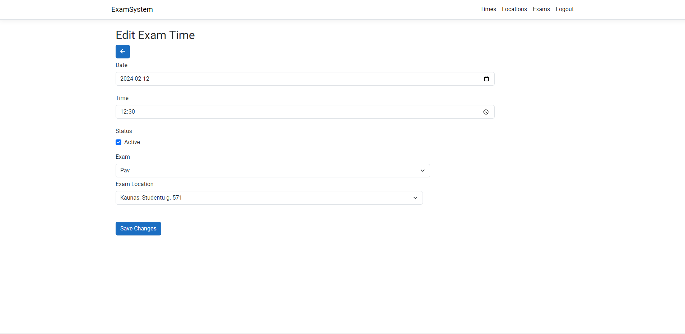

# INFORMATIKOS FAKULTETAS

## T120B165 Saityno taikomųjų programų projektavimas

### Projekto „Egzaminavimo sistema“ ataskaita

Studentas: Justas Lisajus, IFF-0/2

Dėstytojai: Tomas Blažauskas, Kiudys Eligijus

KAUNAS 2023

## Turinys
- [INFORMATIKOS FAKULTETAS](#informatikos-fakultetas)
  - [T120B165 Saityno taikomųjų programų projektavimas](#t120b165-saityno-taikomųjų-programų-projektavimas)
    - [Projekto „Egzaminavimo sistema“ ataskaita](#projekto-egzaminavimo-sistema-ataskaita)
  - [Turinys](#turinys)
    - [Sprendžiamo uždavinio aprašymas](#sprendžiamo-uždavinio-aprašymas)
    - [Sistemos paskirtis](#sistemos-paskirtis)
    - [Funkciniai reikalavimai](#funkciniai-reikalavimai)
    - [Sistemos architektūra](#sistemos-architektūra)
- [API specifikacija](#api-specifikacija)
  - [Answers](#answers)
  - [Exam Locations](#exam-locations)
  - [Exams](#exams)
  - [Users](#users)
  - [ExamTime](#examtime)
- [Naudotojo sąsajos projektas](#naudotojo-sąsajos-projektas)
- [Išvados](#išvados)

### Sprendžiamo uždavinio aprašymas

### Sistemos paskirtis

Projekto tikslas – sukurti lengvai naudojamą egzaminavimo platformą, kuri suteikia įrankius egzaminuotojams, sukurti ir pateikti egzaminus. Taip pat ir vartotojams suteikti, nesudėtingą egzamino laikymą.

Veikimo principas – pačią kuriamą platformą sudarys dvi posistemės. Viena bus vartotojo, kuris laiko egzaminus, peržiūri savo išlaikytus egzaminus. Kita administratoriaus, egzaminu sudarytojo sistema, kuri suteikia galimybes, kurti klausimus, egzaminus ir egzaminavimo vietas.

Egzaminuotojas užsiregistruos į platformą. Sukurs egzaminą, jam klausimus, atsakymus, egzamino laikymo vietas. Tūrės savo specifinį egzaminuotojo kodą, kurį pateiks egzaminą laikantiems asmenims. Asmenys laikantys egzaminus užsiregistruojant į platformą pateiks egzaminuotojo kodą, taip bus surištas su egzaminuotojo sudarytais egzaminais. Vartotojai galės matyti savo egzamino laikymo rezultatus, o administratoriai bendras laikymo statistikas.

### Funkciniai reikalavimai

**Neregistruotas sistemos naudotojas galės:**

- Peržiūrėti platformos pagrindinį puslapį.
- Prisijungti prie paskyros.
- Peržiūrėti įvairių egzaminų laikus.
- Užsiregistruoti prie platformos.

**Registruotas sistemos naudotojas galės:**

- Atsijungti nuo paskyros.
- Prisijungti (užsiregistruoti) prie platformos.
- Pasirinkti egzaminus.
- Laikyti egzaminus.
- Peržiūrėti egzaminų rezultatus.

**Administratorius galės:**

- Prisijungti prie paskyros.
- Atsijungti nuo paskyros.
- Sudaryti klausimus.
- Šalinti klausimus.
- Redaguoti klausimus.
- Peržiūrėti klausimų sąrašus.
- Sudaryti atsakymus.
- Šalinti atsakymus.
- Redaguoti atsakymus.
- Peržiūrėti atsakymų sąrašus.
- Sudaryti egzamino laikymo vietas.
- Redaguoti egzamino laikymo vietas.
- Šalinti egzamino laikymo vietas.
- Peržiūrėti egzaminų laikymo vietų sąrašą.
- Šalinti naudotojus.
- Sudaryti egzaminus.
- Redaguoti egzaminus.
- Šalinti egzaminus.
- Peržiūrėti egzaminų sąrašą.
- Peržiūrėti egzaminų išlaikymo procentą.
- Paskelbti egzamino laikus.
- Redaguoti egzamino laikus.
- Šalinti egzamino laikus.
- Peržiūrėti egzamino laikų sąrašą.
- Patvirtinti naudotojus laikančius egzaminą.

### Sistemos architektūra

Sistemos sudedamosios dalys:

- Kliento pusė (ang. Front-End) – naudojant React.js;
- Serverio pusė (angl. Back-End) – naudojant ASP.NET. Duomenų bazė – MySQL.


Pav. 2.1. Sistemos diegimo diagrama. 

Sistemos talpinimui yra naudojamas Azure serveris. Kiekviena sistemos dalis yra diegiama tame pačiame serveryje. Internetinė aplikacija yra pasiekiama per HTTPS protokolą. Serverio pusė .NET ir Kliento pusė React.js yra atskiros aplikacijos, kurios komunikuos tarpusavyje HTTPS protokolu. Duomenų bazė komunikuos tik su .NET aplikacija naudojant TCP/IP protokolą.

# API specifikacija

## Answers

### /api/Exams/{examId}/Questions/{questionId}/Answers

#### GET
##### Parameters

| Name | Located in | Description | Required | Schema |
| ---- | ---------- | ----------- | -------- | ---- |
| examId | path |  | Yes | string (uuid) |
| questionId | path |  | Yes | string (uuid) |
| pageNumber | query |  | No | integer |

##### Responses

| Code | Description |
| ---- | ----------- |
| 200 | Success |

```json
[
  {
    "id": "3fa85f64-5717-4562-b3fc-2c963f66afa6",
    "title": "string",
    "description": "string",
    "isCorrect": true,
    "question": "string",
    "questionId": "3fa85f64-5717-4562-b3fc-2c963f66afa6",
    "user": {
      "id": "3fa85f64-5717-4562-b3fc-2c963f66afa6",
      "userName": "string",
      "normalizedUserName": "string",
      "email": "string",
      "normalizedEmail": "string",
      "emailConfirmed": true,
      "passwordHash": "string",
      "securityStamp": "string",
      "concurrencyStamp": "string",
      "phoneNumber": "string",
      "phoneNumberConfirmed": true,
      "twoFactorEnabled": true,
      "lockoutEnd": "2024-01-08T02:30:18.751Z",
      "lockoutEnabled": true,
      "accessFailedCount": 0,
      "name": "string",
      "lastName": "string",
      "status": 1,
      "forceRelogin": true
    },
    "userId": "3fa85f64-5717-4562-b3fc-2c963f66afa6"
  }
]
```


#### POST
##### Parameters

| Name | Located in | Description | Required | Schema |
| ---- | ---------- | ----------- | -------- | ---- |
| examId | path |  | Yes | string (uuid) |
| questionId | path |  | Yes | string (uuid) |

```json
{
  "id": "3fa85f64-5717-4562-b3fc-2c963f66afa6",
  "title": "string",
  "description": "string",
  "isCorrect": true,
  "questionId": "3fa85f64-5717-4562-b3fc-2c963f66afa6",
  "userId": "3fa85f64-5717-4562-b3fc-2c963f66afa6"
}
```

##### Responses

| Code | Description |
| ---- | ----------- |
| 200 | Success |

```json
{
  "id": "3fa85f64-5717-4562-b3fc-2c963f66afa6",
  "title": "string",
  "description": "string",
  "isCorrect": true,
  "question": {
    "id": "3fa85f64-5717-4562-b3fc-2c963f66afa6",
    "number": 0,
    "description": "string",
    "exam": {
      "id": "3fa85f64-5717-4562-b3fc-2c963f66afa6",
      "number": 0,
      "name": "string",
      "status": 1,
      "questions": [
        "string"
      ]
    },
    "examId": "3fa85f64-5717-4562-b3fc-2c963f66afa6",
    "answers": [
      "string"
    ],
    "user": {
      "id": "3fa85f64-5717-4562-b3fc-2c963f66afa6",
      "userName": "string",
      "normalizedUserName": "string",
      "email": "string",
      "normalizedEmail": "string",
      "emailConfirmed": true,
      "passwordHash": "string",
      "securityStamp": "string",
      "concurrencyStamp": "string",
      "phoneNumber": "string",
      "phoneNumberConfirmed": true,
      "twoFactorEnabled": true,
      "lockoutEnd": "2024-01-08T02:32:33.097Z",
      "lockoutEnabled": true,
      "accessFailedCount": 0,
      "name": "string",
      "lastName": "string",
      "status": 1,
      "forceRelogin": true
    },
    "userId": "3fa85f64-5717-4562-b3fc-2c963f66afa6"
  },
  "questionId": "3fa85f64-5717-4562-b3fc-2c963f66afa6",
  "user": {
    "id": "3fa85f64-5717-4562-b3fc-2c963f66afa6",
    "userName": "string",
    "normalizedUserName": "string",
    "email": "string",
    "normalizedEmail": "string",
    "emailConfirmed": true,
    "passwordHash": "string",
    "securityStamp": "string",
    "concurrencyStamp": "string",
    "phoneNumber": "string",
    "phoneNumberConfirmed": true,
    "twoFactorEnabled": true,
    "lockoutEnd": "2024-01-08T02:32:33.097Z",
    "lockoutEnabled": true,
    "accessFailedCount": 0,
    "name": "string",
    "lastName": "string",
    "status": 1,
    "forceRelogin": true
  },
  "userId": "3fa85f64-5717-4562-b3fc-2c963f66afa6"
}
```

### /api/Exams/{examId}/Questions/{questionId}/Answers/id

#### GET
##### Parameters

| Name | Located in | Description | Required | Schema |
| ---- | ---------- | ----------- | -------- | ---- |
| examId | path |  | Yes | string (uuid) |
| questionId | path |  | Yes | string (uuid) |
| id | path |  | Yes | string (uuid) |

##### Responses

| Code | Description |
| ---- | ----------- |
| 200 | Success |

```json
{
  "id": "3fa85f64-5717-4562-b3fc-2c963f66afa6",
  "title": "string",
  "description": "string",
  "isCorrect": true,
  "question": {
    "id": "3fa85f64-5717-4562-b3fc-2c963f66afa6",
    "number": 0,
    "description": "string",
    "exam": {
      "id": "3fa85f64-5717-4562-b3fc-2c963f66afa6",
      "number": 0,
      "name": "string",
      "status": 1,
      "questions": [
        "string"
      ]
    },
    "examId": "3fa85f64-5717-4562-b3fc-2c963f66afa6",
    "answers": [
      "string"
    ],
    "user": {
      "id": "3fa85f64-5717-4562-b3fc-2c963f66afa6",
      "userName": "string",
      "normalizedUserName": "string",
      "email": "string",
      "normalizedEmail": "string",
      "emailConfirmed": true,
      "passwordHash": "string",
      "securityStamp": "string",
      "concurrencyStamp": "string",
      "phoneNumber": "string",
      "phoneNumberConfirmed": true,
      "twoFactorEnabled": true,
      "lockoutEnd": "2024-01-08T02:32:54.921Z",
      "lockoutEnabled": true,
      "accessFailedCount": 0,
      "name": "string",
      "lastName": "string",
      "status": 1,
      "forceRelogin": true
    },
    "userId": "3fa85f64-5717-4562-b3fc-2c963f66afa6"
  },
  "questionId": "3fa85f64-5717-4562-b3fc-2c963f66afa6",
  "user": {
    "id": "3fa85f64-5717-4562-b3fc-2c963f66afa6",
    "userName": "string",
    "normalizedUserName": "string",
    "email": "string",
    "normalizedEmail": "string",
    "emailConfirmed": true,
    "passwordHash": "string",
    "securityStamp": "string",
    "concurrencyStamp": "string",
    "phoneNumber": "string",
    "phoneNumberConfirmed": true,
    "twoFactorEnabled": true,
    "lockoutEnd": "2024-01-08T02:32:54.921Z",
    "lockoutEnabled": true,
    "accessFailedCount": 0,
    "name": "string",
    "lastName": "string",
    "status": 1,
    "forceRelogin": true
  },
  "userId": "3fa85f64-5717-4562-b3fc-2c963f66afa6"
}
```

#### PUT
##### Parameters

| Name | Located in | Description | Required | Schema |
| ---- | ---------- | ----------- | -------- | ---- |
| examId | path |  | Yes | string (uuid) |
| questionId | path |  | Yes | string (uuid) |
| id | path |  | Yes | string (uuid) |

```json
{
  "id": "3fa85f64-5717-4562-b3fc-2c963f66afa6",
  "title": "string",
  "description": "string",
  "isCorrect": true,
  "question": {
    "id": "3fa85f64-5717-4562-b3fc-2c963f66afa6",
    "number": 0,
    "description": "string",
    "exam": {
      "id": "3fa85f64-5717-4562-b3fc-2c963f66afa6",
      "number": 0,
      "name": "string",
      "status": 1,
      "questions": [
        "string"
      ]
    },
    "examId": "3fa85f64-5717-4562-b3fc-2c963f66afa6",
    "answers": [
      "string"
    ],
    "user": {
      "id": "3fa85f64-5717-4562-b3fc-2c963f66afa6",
      "userName": "string",
      "normalizedUserName": "string",
      "email": "string",
      "normalizedEmail": "string",
      "emailConfirmed": true,
      "passwordHash": "string",
      "securityStamp": "string",
      "concurrencyStamp": "string",
      "phoneNumber": "string",
      "phoneNumberConfirmed": true,
      "twoFactorEnabled": true,
      "lockoutEnd": "2024-01-08T02:33:18.802Z",
      "lockoutEnabled": true,
      "accessFailedCount": 0,
      "name": "string",
      "lastName": "string",
      "status": 1,
      "forceRelogin": true
    },
    "userId": "3fa85f64-5717-4562-b3fc-2c963f66afa6"
  },
  "questionId": "3fa85f64-5717-4562-b3fc-2c963f66afa6",
  "user": {
    "id": "3fa85f64-5717-4562-b3fc-2c963f66afa6",
    "userName": "string",
    "normalizedUserName": "string",
    "email": "string",
    "normalizedEmail": "string",
    "emailConfirmed": true,
    "passwordHash": "string",
    "securityStamp": "string",
    "concurrencyStamp": "string",
    "phoneNumber": "string",
    "phoneNumberConfirmed": true,
    "twoFactorEnabled": true,
    "lockoutEnd": "2024-01-08T02:33:18.802Z",
    "lockoutEnabled": true,
    "accessFailedCount": 0,
    "name": "string",
    "lastName": "string",
    "status": 1,
    "forceRelogin": true
  },
  "userId": "3fa85f64-5717-4562-b3fc-2c963f66afa6"
}
```

##### Responses

| Code | Description |
| ---- | ----------- |
| 200 | Success |

#### DELETE
##### Parameters

| Name | Located in | Description | Required | Schema |
| ---- | ---------- | ----------- | -------- | ---- |
| examId | path |  | Yes | string (uuid) |
| questionId | path |  | Yes | string (uuid) |
| id | path |  | Yes | string (uuid) |

##### Responses

| Code | Description |
| ---- | ----------- |
| 200 | Success |

## Exam Locations

### /api/ExamLocations

#### GET
##### Parameters

| Name | Located in | Description | Required | Schema |
| ---- | ---------- | ----------- | -------- | ---- |
| pageNumber | query |  | No | integer |

##### Responses

| Code | Description |
| ---- | ----------- |
| 200 | Success |

```json
[
  {
    "id": "3fa85f64-5717-4562-b3fc-2c963f66afa6",
    "name": "string",
    "status": 1
  }
]
```

#### POST
```json
{
  "id": "3fa85f64-5717-4562-b3fc-2c963f66afa6",
  "name": "string",
  "status": 1
}
```
##### Responses

| Code | Description |
| ---- | ----------- |
| 200 | Success |

### /api/ExamLocations/id

#### GET
##### Parameters

| Name | Located in | Description | Required | Schema |
| ---- | ---------- | ----------- | -------- | ---- |
| id | path |  | Yes | string (uuid) |

##### Responses

| Code | Description |
| ---- | ----------- |
| 200 | Success |

```json
{
  "id": "3fa85f64-5717-4562-b3fc-2c963f66afa6",
  "name": "string",
  "status": 1
}
```

#### PUT
##### Parameters

| Name | Located in | Description | Required | Schema |
| ---- | ---------- | ----------- | -------- | ---- |
| id | path |  | Yes | string (uuid) |

```json
{
  "id": "3fa85f64-5717-4562-b3fc-2c963f66afa6",
  "name": "string",
  "status": 1
}
```

##### Responses

| Code | Description |
| ---- | ----------- |
| 200 | Success |

#### DELETE
##### Parameters

| Name | Located in | Description | Required | Schema |
| ---- | ---------- | ----------- | -------- | ---- |
| id | path |  | Yes | string (uuid) |

##### Responses

| Code | Description |
| ---- | ----------- |
| 200 | Success |

## Exams

### /api/Exams

#### GET
##### Parameters

| Name | Located in | Description | Required | Schema |
| ---- | ---------- | ----------- | -------- | ---- |
| pageNumber | query |  | No | integer |

##### Responses

| Code | Description |
| ---- | ----------- |
| 200 | Success |

```json
[
  {
    "id": "3fa85f64-5717-4562-b3fc-2c963f66afa6",
    "number": 0,
    "name": "string",
    "status": 1,
    "questions": [
      {
        "id": "3fa85f64-5717-4562-b3fc-2c963f66afa6",
        "number": 0,
        "description": "string",
        "exam": "string",
        "examId": "3fa85f64-5717-4562-b3fc-2c963f66afa6",
        "answers": [
          {
            "id": "3fa85f64-5717-4562-b3fc-2c963f66afa6",
            "title": "string",
            "description": "string",
            "isCorrect": true,
            "question": "string",
            "questionId": "3fa85f64-5717-4562-b3fc-2c963f66afa6",
            "user": {
              "id": "3fa85f64-5717-4562-b3fc-2c963f66afa6",
              "userName": "string",
              "normalizedUserName": "string",
              "email": "string",
              "normalizedEmail": "string",
              "emailConfirmed": true,
              "passwordHash": "string",
              "securityStamp": "string",
              "concurrencyStamp": "string",
              "phoneNumber": "string",
              "phoneNumberConfirmed": true,
              "twoFactorEnabled": true,
              "lockoutEnd": "2024-01-08T02:37:55.072Z",
              "lockoutEnabled": true,
              "accessFailedCount": 0,
              "name": "string",
              "lastName": "string",
              "status": 1,
              "forceRelogin": true
            },
            "userId": "3fa85f64-5717-4562-b3fc-2c963f66afa6"
          }
        ],
        "user": {
          "id": "3fa85f64-5717-4562-b3fc-2c963f66afa6",
          "userName": "string",
          "normalizedUserName": "string",
          "email": "string",
          "normalizedEmail": "string",
          "emailConfirmed": true,
          "passwordHash": "string",
          "securityStamp": "string",
          "concurrencyStamp": "string",
          "phoneNumber": "string",
          "phoneNumberConfirmed": true,
          "twoFactorEnabled": true,
          "lockoutEnd": "2024-01-08T02:37:55.072Z",
          "lockoutEnabled": true,
          "accessFailedCount": 0,
          "name": "string",
          "lastName": "string",
          "status": 1,
          "forceRelogin": true
        },
        "userId": "3fa85f64-5717-4562-b3fc-2c963f66afa6"
      }
    ]
  }
]
```

#### POST

```json
{
  "id": "3fa85f64-5717-4562-b3fc-2c963f66afa6",
  "number": 0,
  "name": "string",
  "status": 1
}
```

##### Responses

| Code | Description |
| ---- | ----------- |
| 200 | Success |

### /api/Exams/id

#### GET
##### Parameters

| Name | Located in | Description | Required | Schema |
| ---- | ---------- | ----------- | -------- | ---- |
| id | path |  | Yes | string (uuid) |

##### Responses

| Code | Description |
| ---- | ----------- |
| 200 | Success |

```json
{
  "id": "3fa85f64-5717-4562-b3fc-2c963f66afa6",
  "number": 0,
  "name": "string",
  "status": 1,
  "questions": [
    {
      "id": "3fa85f64-5717-4562-b3fc-2c963f66afa6",
      "number": 0,
      "description": "string",
      "exam": "string",
      "examId": "3fa85f64-5717-4562-b3fc-2c963f66afa6",
      "answers": [
        {
          "id": "3fa85f64-5717-4562-b3fc-2c963f66afa6",
          "title": "string",
          "description": "string",
          "isCorrect": true,
          "question": "string",
          "questionId": "3fa85f64-5717-4562-b3fc-2c963f66afa6",
          "user": {
            "id": "3fa85f64-5717-4562-b3fc-2c963f66afa6",
            "userName": "string",
            "normalizedUserName": "string",
            "email": "string",
            "normalizedEmail": "string",
            "emailConfirmed": true,
            "passwordHash": "string",
            "securityStamp": "string",
            "concurrencyStamp": "string",
            "phoneNumber": "string",
            "phoneNumberConfirmed": true,
            "twoFactorEnabled": true,
            "lockoutEnd": "2024-01-08T02:39:32.280Z",
            "lockoutEnabled": true,
            "accessFailedCount": 0,
            "name": "string",
            "lastName": "string",
            "status": 1,
            "forceRelogin": true
          },
          "userId": "3fa85f64-5717-4562-b3fc-2c963f66afa6"
        }
      ],
      "user": {
        "id": "3fa85f64-5717-4562-b3fc-2c963f66afa6",
        "userName": "string",
        "normalizedUserName": "string",
        "email": "string",
        "normalizedEmail": "string",
        "emailConfirmed": true,
        "passwordHash": "string",
        "securityStamp": "string",
        "concurrencyStamp": "string",
        "phoneNumber": "string",
        "phoneNumberConfirmed": true,
        "twoFactorEnabled": true,
        "lockoutEnd": "2024-01-08T02:39:32.280Z",
        "lockoutEnabled": true,
        "accessFailedCount": 0,
        "name": "string",
        "lastName": "string",
        "status": 1,
        "forceRelogin": true
      },
      "userId": "3fa85f64-5717-4562-b3fc-2c963f66afa6"
    }
  ]
}
```

#### PUT
##### Parameters

| Name | Located in | Description | Required | Schema |
| ---- | ---------- | ----------- | -------- | ---- |
| id | path |  | Yes | string (uuid) |

##### Responses

| Code | Description |
| ---- | ----------- |
| 200 | Success |

```json
{
  "id": "3fa85f64-5717-4562-b3fc-2c963f66afa6",
  "number": 0,
  "name": "string",
  "status": 1,
  "questions": [
    {
      "id": "3fa85f64-5717-4562-b3fc-2c963f66afa6",
      "number": 0,
      "description": "string",
      "exam": "string",
      "examId": "3fa85f64-5717-4562-b3fc-2c963f66afa6",
      "answers": [
        {
          "id": "3fa85f64-5717-4562-b3fc-2c963f66afa6",
          "title": "string",
          "description": "string",
          "isCorrect": true,
          "question": "string",
          "questionId": "3fa85f64-5717-4562-b3fc-2c963f66afa6",
          "user": {
            "id": "3fa85f64-5717-4562-b3fc-2c963f66afa6",
            "userName": "string",
            "normalizedUserName": "string",
            "email": "string",
            "normalizedEmail": "string",
            "emailConfirmed": true,
            "passwordHash": "string",
            "securityStamp": "string",
            "concurrencyStamp": "string",
            "phoneNumber": "string",
            "phoneNumberConfirmed": true,
            "twoFactorEnabled": true,
            "lockoutEnd": "2024-01-08T02:39:58.227Z",
            "lockoutEnabled": true,
            "accessFailedCount": 0,
            "name": "string",
            "lastName": "string",
            "status": 1,
            "forceRelogin": true
          },
          "userId": "3fa85f64-5717-4562-b3fc-2c963f66afa6"
        }
      ],
      "user": {
        "id": "3fa85f64-5717-4562-b3fc-2c963f66afa6",
        "userName": "string",
        "normalizedUserName": "string",
        "email": "string",
        "normalizedEmail": "string",
        "emailConfirmed": true,
        "passwordHash": "string",
        "securityStamp": "string",
        "concurrencyStamp": "string",
        "phoneNumber": "string",
        "phoneNumberConfirmed": true,
        "twoFactorEnabled": true,
        "lockoutEnd": "2024-01-08T02:39:58.227Z",
        "lockoutEnabled": true,
        "accessFailedCount": 0,
        "name": "string",
        "lastName": "string",
        "status": 1,
        "forceRelogin": true
      },
      "userId": "3fa85f64-5717-4562-b3fc-2c963f66afa6"
    }
  ]
}
```

#### DELETE
##### Parameters

| Name | Located in | Description | Required | Schema |
| ---- | ---------- | ----------- | -------- | ---- |
| id | path |  | Yes | string (uuid) |

##### Responses

| Code | Description |
| ---- | ----------- |
| 200 | Success |

## Users

### /api/Register

#### POST

```json
{
  "username": "string",
  "name": "string",
  "lastName": "string",
  "email": "string",
  "password": "string"
}
```

##### Responses

| Code | Description |
| ---- | ----------- |
| 200 | Success |

### /api/Login

#### POST

```json
{
  "username": "string",
  "password": "string"
}
```

##### Responses

| Code | Description |
| ---- | ----------- |
| 200 | Success |

### /api/AccessToken

#### POST

```json
{
  "refreshToken": "string"
}
```

##### Responses

| Code | Description |
| ---- | ----------- |
| 200 | Success |

## ExamTime

### /api/ExamTimes

#### GET
##### Parameters

| Name | Located in | Description | Required | Schema |
| ---- | ---------- | ----------- | -------- | ---- |
| pageNumber | query |  | No | integer |

##### Responses

| Code | Description |
| ---- | ----------- |
| 200 | Success |

```json
[
  {
    "id": "3fa85f64-5717-4562-b3fc-2c963f66afa6",
    "date": "2024-01-08T02:41:51.032Z",
    "time": "2024-01-08T02:41:51.032Z",
    "status": 1,
    "exam": {
      "id": "3fa85f64-5717-4562-b3fc-2c963f66afa6",
      "number": 0,
      "name": "string",
      "status": 1,
      "questions": [
        {
          "id": "3fa85f64-5717-4562-b3fc-2c963f66afa6",
          "number": 0,
          "description": "string",
          "exam": "string",
          "examId": "3fa85f64-5717-4562-b3fc-2c963f66afa6",
          "answers": [
            {
              "id": "3fa85f64-5717-4562-b3fc-2c963f66afa6",
              "title": "string",
              "description": "string",
              "isCorrect": true,
              "question": "string",
              "questionId": "3fa85f64-5717-4562-b3fc-2c963f66afa6",
              "user": {
                "id": "3fa85f64-5717-4562-b3fc-2c963f66afa6",
                "userName": "string",
                "normalizedUserName": "string",
                "email": "string",
                "normalizedEmail": "string",
                "emailConfirmed": true,
                "passwordHash": "string",
                "securityStamp": "string",
                "concurrencyStamp": "string",
                "phoneNumber": "string",
                "phoneNumberConfirmed": true,
                "twoFactorEnabled": true,
                "lockoutEnd": "2024-01-08T02:41:51.032Z",
                "lockoutEnabled": true,
                "accessFailedCount": 0,
                "name": "string",
                "lastName": "string",
                "status": 1,
                "forceRelogin": true
              },
              "userId": "3fa85f64-5717-4562-b3fc-2c963f66afa6"
            }
          ],
          "user": {
            "id": "3fa85f64-5717-4562-b3fc-2c963f66afa6",
            "userName": "string",
            "normalizedUserName": "string",
            "email": "string",
            "normalizedEmail": "string",
            "emailConfirmed": true,
            "passwordHash": "string",
            "securityStamp": "string",
            "concurrencyStamp": "string",
            "phoneNumber": "string",
            "phoneNumberConfirmed": true,
            "twoFactorEnabled": true,
            "lockoutEnd": "2024-01-08T02:41:51.032Z",
            "lockoutEnabled": true,
            "accessFailedCount": 0,
            "name": "string",
            "lastName": "string",
            "status": 1,
            "forceRelogin": true
          },
          "userId": "3fa85f64-5717-4562-b3fc-2c963f66afa6"
        }
      ]
    },
    "examId": "3fa85f64-5717-4562-b3fc-2c963f66afa6",
    "examLocation": {
      "id": "3fa85f64-5717-4562-b3fc-2c963f66afa6",
      "name": "string",
      "status": 1
    },
    "examLocationId": "3fa85f64-5717-4562-b3fc-2c963f66afa6"
  }
]
```

#### POST

```json
{
  "id": "3fa85f64-5717-4562-b3fc-2c963f66afa6",
  "date": "2024-01-08T02:42:37.871Z",
  "time": "2024-01-08T02:42:37.871Z",
  "status": 1,
  "examId": "3fa85f64-5717-4562-b3fc-2c963f66afa6",
  "examLocationId": "3fa85f64-5717-4562-b3fc-2c963f66afa6"
}
```

##### Responses

| Code | Description |
| ---- | ----------- |
| 200 | Success |

### /api/ExamTimes/id

#### GET
##### Parameters

| Name | Located in | Description | Required | Schema |
| ---- | ---------- | ----------- | -------- | ---- |
| id | path |  | Yes | string (uuid) |

##### Responses

| Code | Description |
| ---- | ----------- |
| 200 | Success |

```json
{
  "id": "3fa85f64-5717-4562-b3fc-2c963f66afa6",
  "date": "2024-01-08T02:43:15.814Z",
  "time": "2024-01-08T02:43:15.814Z",
  "status": 1,
  "exam": {
    "id": "3fa85f64-5717-4562-b3fc-2c963f66afa6",
    "number": 0,
    "name": "string",
    "status": 1,
    "questions": [
      {
        "id": "3fa85f64-5717-4562-b3fc-2c963f66afa6",
        "number": 0,
        "description": "string",
        "exam": "string",
        "examId": "3fa85f64-5717-4562-b3fc-2c963f66afa6",
        "answers": [
          {
            "id": "3fa85f64-5717-4562-b3fc-2c963f66afa6",
            "title": "string",
            "description": "string",
            "isCorrect": true,
            "question": "string",
            "questionId": "3fa85f64-5717-4562-b3fc-2c963f66afa6",
            "user": {
              "id": "3fa85f64-5717-4562-b3fc-2c963f66afa6",
              "userName": "string",
              "normalizedUserName": "string",
              "email": "string",
              "normalizedEmail": "string",
              "emailConfirmed": true,
              "passwordHash": "string",
              "securityStamp": "string",
              "concurrencyStamp": "string",
              "phoneNumber": "string",
              "phoneNumberConfirmed": true,
              "twoFactorEnabled": true,
              "lockoutEnd": "2024-01-08T02:43:15.814Z",
              "lockoutEnabled": true,
              "accessFailedCount": 0,
              "name": "string",
              "lastName": "string",
              "status": 1,
              "forceRelogin": true
            },
            "userId": "3fa85f64-5717-4562-b3fc-2c963f66afa6"
          }
        ],
        "user": {
          "id": "3fa85f64-5717-4562-b3fc-2c963f66afa6",
          "userName": "string",
          "normalizedUserName": "string",
          "email": "string",
          "normalizedEmail": "string",
          "emailConfirmed": true,
          "passwordHash": "string",
          "securityStamp": "string",
          "concurrencyStamp": "string",
          "phoneNumber": "string",
          "phoneNumberConfirmed": true,
          "twoFactorEnabled": true,
          "lockoutEnd": "2024-01-08T02:43:15.814Z",
          "lockoutEnabled": true,
          "accessFailedCount": 0,
          "name": "string",
          "lastName": "string",
          "status": 1,
          "forceRelogin": true
        },
        "userId": "3fa85f64-5717-4562-b3fc-2c963f66afa6"
      }
    ]
  },
  "examId": "3fa85f64-5717-4562-b3fc-2c963f66afa6",
  "examLocation": {
    "id": "3fa85f64-5717-4562-b3fc-2c963f66afa6",
    "name": "string",
    "status": 1
  },
  "examLocationId": "3fa85f64-5717-4562-b3fc-2c963f66afa6"
}
```

#### PUT
##### Parameters

| Name | Located in | Description | Required | Schema |
| ---- | ---------- | ----------- | -------- | ---- |
| id | path |  | Yes | string (uuid) |

```json
{
  "id": "3fa85f64-5717-4562-b3fc-2c963f66afa6",
  "date": "2024-01-08T02:42:37.871Z",
  "time": "2024-01-08T02:42:37.871Z",
  "status": 1,
  "examId": "3fa85f64-5717-4562-b3fc-2c963f66afa6",
  "examLocationId": "3fa85f64-5717-4562-b3fc-2c963f66afa6"
}
```

##### Responses

| Code | Description |
| ---- | ----------- |
| 200 | Success |

#### DELETE
##### Parameters

| Name | Located in | Description | Required | Schema |
| ---- | ---------- | ----------- | -------- | ---- |
| id | path |  | Yes | string (uuid) |

##### Responses

| Code | Description |
| ---- | ----------- |
| 200 | Success |

##Questions

### /api/Exams/{examId}/Questions

#### GET
##### Parameters

| Name | Located in | Description | Required | Schema |
| ---- | ---------- | ----------- | -------- | ---- |
| examId | path |  | Yes | string (uuid) |
| pageNumber | query |  | No | integer |

##### Responses

| Code | Description |
| ---- | ----------- |
| 200 | Success |

```json
[
  {
    "id": "3fa85f64-5717-4562-b3fc-2c963f66afa6",
    "number": 0,
    "description": "string",
    "exam": {
      "id": "3fa85f64-5717-4562-b3fc-2c963f66afa6",
      "number": 0,
      "name": "string",
      "status": 1,
      "questions": [
        "string"
      ]
    },
    "examId": "3fa85f64-5717-4562-b3fc-2c963f66afa6",
    "answers": [
      {
        "id": "3fa85f64-5717-4562-b3fc-2c963f66afa6",
        "title": "string",
        "description": "string",
        "isCorrect": true,
        "question": "string",
        "questionId": "3fa85f64-5717-4562-b3fc-2c963f66afa6",
        "user": {
          "id": "3fa85f64-5717-4562-b3fc-2c963f66afa6",
          "userName": "string",
          "normalizedUserName": "string",
          "email": "string",
          "normalizedEmail": "string",
          "emailConfirmed": true,
          "passwordHash": "string",
          "securityStamp": "string",
          "concurrencyStamp": "string",
          "phoneNumber": "string",
          "phoneNumberConfirmed": true,
          "twoFactorEnabled": true,
          "lockoutEnd": "2024-01-08T02:44:25.505Z",
          "lockoutEnabled": true,
          "accessFailedCount": 0,
          "name": "string",
          "lastName": "string",
          "status": 1,
          "forceRelogin": true
        },
        "userId": "3fa85f64-5717-4562-b3fc-2c963f66afa6"
      }
    ],
    "user": {
      "id": "3fa85f64-5717-4562-b3fc-2c963f66afa6",
      "userName": "string",
      "normalizedUserName": "string",
      "email": "string",
      "normalizedEmail": "string",
      "emailConfirmed": true,
      "passwordHash": "string",
      "securityStamp": "string",
      "concurrencyStamp": "string",
      "phoneNumber": "string",
      "phoneNumberConfirmed": true,
      "twoFactorEnabled": true,
      "lockoutEnd": "2024-01-08T02:44:25.505Z",
      "lockoutEnabled": true,
      "accessFailedCount": 0,
      "name": "string",
      "lastName": "string",
      "status": 1,
      "forceRelogin": true
    },
    "userId": "3fa85f64-5717-4562-b3fc-2c963f66afa6"
  }
]
```

#### POST
##### Parameters

| Name | Located in | Description | Required | Schema |
| ---- | ---------- | ----------- | -------- | ---- |
| examId | path |  | Yes | string (uuid) |

```json
{
  "id": "3fa85f64-5717-4562-b3fc-2c963f66afa6",
  "number": 0,
  "description": "string",
  "examId": "3fa85f64-5717-4562-b3fc-2c963f66afa6",
  "userId": "3fa85f64-5717-4562-b3fc-2c963f66afa6"
}
```

##### Responses

| Code | Description |
| ---- | ----------- |
| 200 | Success |

### /api/Exams/{examId}/Questions/id

#### GET
##### Parameters

| Name | Located in | Description | Required | Schema |
| ---- | ---------- | ----------- | -------- | ---- |
| examId | path |  | Yes | string (uuid) |
| id | path |  | Yes | string (uuid) |

##### Responses

| Code | Description |
| ---- | ----------- |
| 200 | Success |

```json
{
  "id": "3fa85f64-5717-4562-b3fc-2c963f66afa6",
  "number": 0,
  "description": "string",
  "exam": {
    "id": "3fa85f64-5717-4562-b3fc-2c963f66afa6",
    "number": 0,
    "name": "string",
    "status": 1,
    "questions": [
      "string"
    ]
  },
  "examId": "3fa85f64-5717-4562-b3fc-2c963f66afa6",
  "answers": [
    {
      "id": "3fa85f64-5717-4562-b3fc-2c963f66afa6",
      "title": "string",
      "description": "string",
      "isCorrect": true,
      "question": "string",
      "questionId": "3fa85f64-5717-4562-b3fc-2c963f66afa6",
      "user": {
        "id": "3fa85f64-5717-4562-b3fc-2c963f66afa6",
        "userName": "string",
        "normalizedUserName": "string",
        "email": "string",
        "normalizedEmail": "string",
        "emailConfirmed": true,
        "passwordHash": "string",
        "securityStamp": "string",
        "concurrencyStamp": "string",
        "phoneNumber": "string",
        "phoneNumberConfirmed": true,
        "twoFactorEnabled": true,
        "lockoutEnd": "2024-01-08T02:45:22.747Z",
        "lockoutEnabled": true,
        "accessFailedCount": 0,
        "name": "string",
        "lastName": "string",
        "status": 1,
        "forceRelogin": true
      },
      "userId": "3fa85f64-5717-4562-b3fc-2c963f66afa6"
    }
  ],
  "user": {
    "id": "3fa85f64-5717-4562-b3fc-2c963f66afa6",
    "userName": "string",
    "normalizedUserName": "string",
    "email": "string",
    "normalizedEmail": "string",
    "emailConfirmed": true,
    "passwordHash": "string",
    "securityStamp": "string",
    "concurrencyStamp": "string",
    "phoneNumber": "string",
    "phoneNumberConfirmed": true,
    "twoFactorEnabled": true,
    "lockoutEnd": "2024-01-08T02:45:22.747Z",
    "lockoutEnabled": true,
    "accessFailedCount": 0,
    "name": "string",
    "lastName": "string",
    "status": 1,
    "forceRelogin": true
  },
  "userId": "3fa85f64-5717-4562-b3fc-2c963f66afa6"
}
```

#### PUT
##### Parameters

| Name | Located in | Description | Required | Schema |
| ---- | ---------- | ----------- | -------- | ---- |
| examId | path |  | Yes | string (uuid) |
| id | path |  | Yes | string (uuid) |

```json
{
  "id": "3fa85f64-5717-4562-b3fc-2c963f66afa6",
  "number": 0,
  "description": "string",
  "examId": "3fa85f64-5717-4562-b3fc-2c963f66afa6",
  "userId": "3fa85f64-5717-4562-b3fc-2c963f66afa6"
}
```

##### Responses

| Code | Description |
| ---- | ----------- |
| 200 | Success |

#### DELETE
##### Parameters

| Name | Located in | Description | Required | Schema |
| ---- | ---------- | ----------- | -------- | ---- |
| examId | path |  | Yes | string (uuid) |
| id | path |  | Yes | string (uuid) |

##### Responses

| Code | Description |
| ---- | ----------- |
| 200 | Success |

## Naudotojo sąsajos projektas


Pagrindinis langas (svečio atžvilgiu)


Prisijungimo langas


Registracijos langas


Egzamino laikų langas (svečio atžvilgiu)


Pagrindinis langas (administratoriaus atžvilgiu)


Egzaminų sąrašas


Egzaminų trinimo modalas


Naujo egzamino kurimas


Egzamino redagavimas


Egzamino klausimų sąrašas


Klausimo pridėjimas


Klausimo redagavimas


Klausimo trinimo modalas


Klausimo atsakymų sąrašas


Atsakymo pridėjimas


Atsakymo redagavimas


Atsakymo trinimo modalas


Egzamino lokacijų sąrašas


Egzamino lokacijų kurimas


Egzamino lokacijų redagavimas


Egzamino lokacijų trinimo modalas


Egzamino laikų sąrašas


Egzamino laikų kurimas


Egzamino laikų redagavimas


Egzaminno laikų trinimo modalas


Pagrindinis langas (naudotojo atžvilgiu)


Egzaminų sąrašas (naudotojo atžvilgiu)


Egzamino laikų sąrašas (naudotojo atžvilgiu)

## Išvados

Šiame projekte buvo realizuota egzaminavimo sistema. Skirta kurti, egzaminus. Sistema realizuota REST principais su JWT authentifikacija.

Projekta sudaro .NET Core su EntityFramework karkasai serverio pusėje ir React karkasas kliento pusėje.
